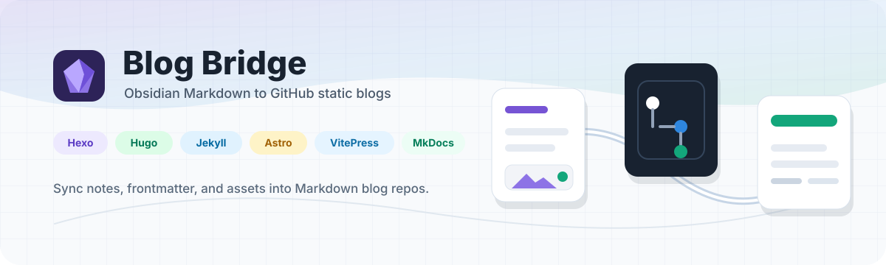
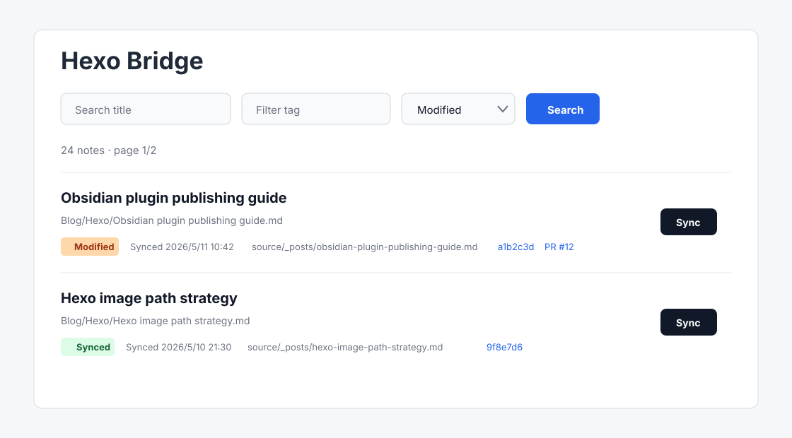
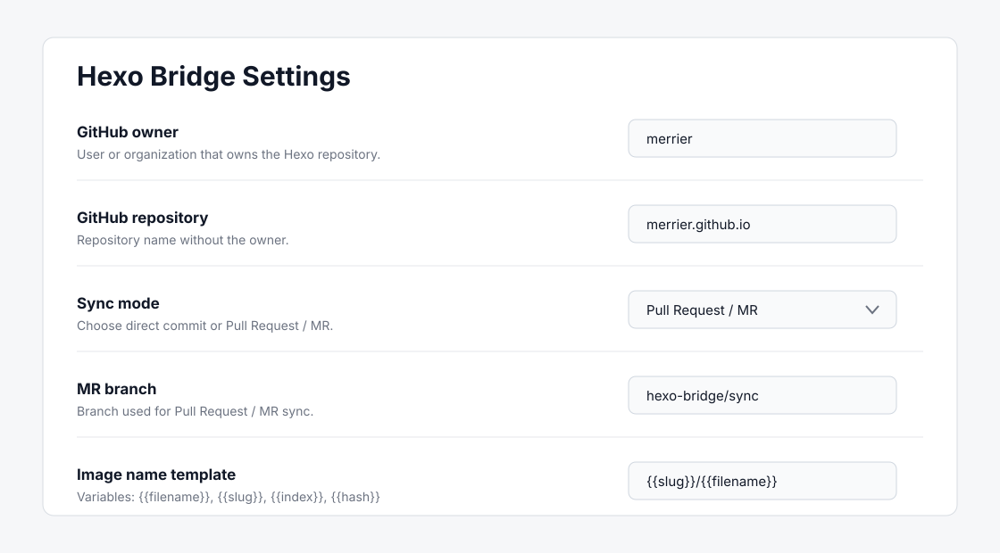

<p align="center">
  
</p>

# Blog Bridge

Blog Bridge is an Obsidian plugin for syncing selected notes to GitHub-backed Markdown static-site blogs.

[Chinese documentation](README_ZH.md)

## Screenshots





## Supported Frameworks

Blog Bridge focuses on file-based Markdown static-site frameworks:

| Framework | Default post path | Default image path |
| --- | --- | --- |
| Hexo | `source/_posts` | `source/images/obsidian` |
| Hugo | `content/posts` | `static/images/obsidian` |
| Jekyll | `_posts` | `assets/images/obsidian` |
| Astro | `src/content/blog` | `public/images/obsidian` |
| VitePress | `docs/posts` | `docs/public/images/obsidian` |
| MkDocs | `docs/blog/posts` | `docs/assets/images/obsidian` |

The paths are configurable, so the presets are starting points rather than hard rules.

## Features

- Sync the current Markdown note to a GitHub repository.
- Choose a target framework preset for path, image URL, and frontmatter conventions.
- Create one GitHub commit for the generated Markdown and local images.
- Choose between direct commits to the target branch or Pull Request / MR sync from a custom branch.
- Preserve existing frontmatter and fill missing `title` and `date`.
- Use frontmatter `slug` or `urlname` for the output file name, then fall back to a slugified title.
- Use Jekyll's dated post filename convention automatically.
- Open a sync status page from the ribbon icon, with title, tag, status filters, page-size options, and batch sync.
- Mark notes as `Modified` when they changed locally after the last successful sync.
- Follow the current Obsidian app language for Chinese and English UI text.
- Store tokens through Obsidian SecretStorage; plugin data only stores the secret name.

## Installation

Install Blog Bridge from Obsidian's Community Plugins marketplace:

1. Open Obsidian `Settings`.
2. Go to `Community plugins` and turn off `Restricted mode` if needed.
3. Choose `Browse`, search for `Blog Bridge`, then install and enable it.

For local development from source:

```bash
cd .obsidian/plugins
git clone https://github.com/merrier/obsidian-blog-bridge.git
cd obsidian-blog-bridge
npm install
npm run build
```

## Settings

Configure the plugin from the settings tab:

- `Blog framework`: target Markdown static-site framework.
- `GitHub owner`: user or organization that owns the blog repository.
- `GitHub repository`: repository name without the owner.
- `GitHub branch`: target branch, defaults to `main`. The branch must already exist.
- `Sync mode`: choose `Direct commit` or `Pull Request / MR`.
- `MR branch`: branch used for Pull Request / MR sync, defaults to `blog-bridge/sync`. It must differ from the target branch.
- `GitHub token`: select an Obsidian SecretStorage entry. The plugin currently accepts tokens that start with `ghp_`.
- `Sync source directory`: vault folder shown in the status page.
- `Blog note template`: optional Markdown template for new notes.
- `Apply template to new notes`: off by default. When enabled, new empty Markdown files in the sync source directory receive the selected template content.
- `Posts directory`: post path in the GitHub repository.
- `Local image directory`: image path in the GitHub repository.
- `Image name template`: defaults to `{{slug}}/{{filename}}`.
- `Git commit message template`: defaults to `chore(blog): sync {{title}}`.

## Token Permissions

Use a GitHub classic personal access token because Blog Bridge validates the `ghp_` prefix.

- Direct commit mode needs content read/write access to the target repository.
- Pull Request / MR mode also needs permission to create and update pull requests.
- The token value is stored by Obsidian SecretStorage. Blog Bridge only stores the selected secret name in `data.json`.

## Usage

- Click the ribbon icon to open the Blog Bridge status page.
- Filter notes from the status page and click `Sync` on a row, or select multiple notes and run `Sync selected`.
- Or run `Sync current note to blog` from the command palette.
- After a successful sync, the status page records the target path, commit link, and Pull Request link.
- If a note changes locally after a successful sync, its status becomes `Modified` and it can be synced again.

## Image Handling

Blog Bridge only supports local images. It does not depend on image hosting services.

The plugin resolves Markdown image links and Obsidian wiki image links, commits local images as blobs in the same GitHub commit, and rewrites Markdown links to public site paths for the selected framework.

Image name template variables:

```text
{{filename}} {{slug}} {{index}} {{hash}} {{original}} {{ext}} {{date}}
```

`{{filename}}` preserves the Obsidian attachment file name.

## Template Variables

Blog note templates support:

```text
{{title}} {{slug}} {{date}} {{datetime}}
```

Image name templates support:

```text
{{filename}} {{slug}} {{index}} {{hash}} {{original}} {{ext}} {{date}}
```

Commit message templates support:

```text
{{title}} {{slug}} {{status}}
```

## Current Limits

- Manual sync only. There is no automatic watcher, batch sync, or scheduled sync.
- Local images only. PicGo and other image hosting workflows are not supported.
- Token authentication only. GitHub OAuth is not supported yet.
- MDX-specific transforms are not implemented yet; Markdown is synced as Markdown.

## Development

```bash
npm install
npm run build
```

The build produces `main.js`, which Obsidian loads from the plugin directory.

## Sponsor

If Blog Bridge saves you time maintaining your blog, you can support the author through GitHub Sponsors:

[Sponsor merrier on GitHub](https://github.com/sponsors/merrier)
